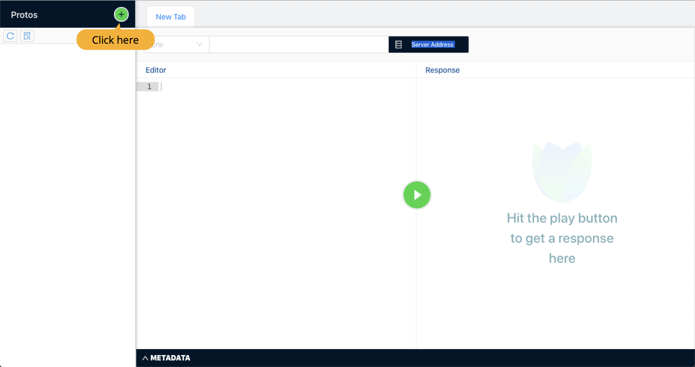
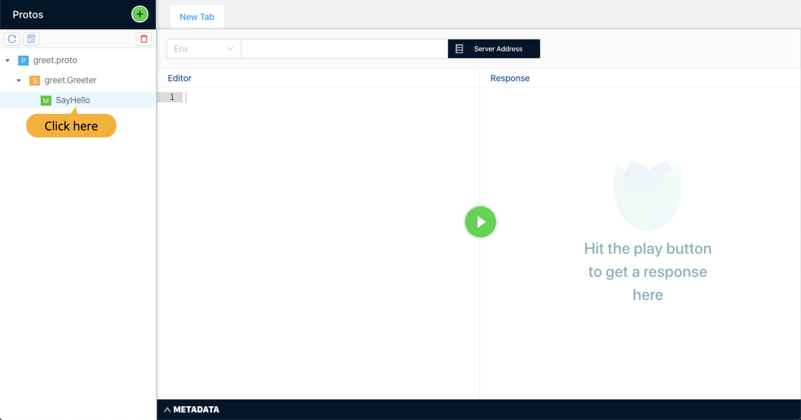
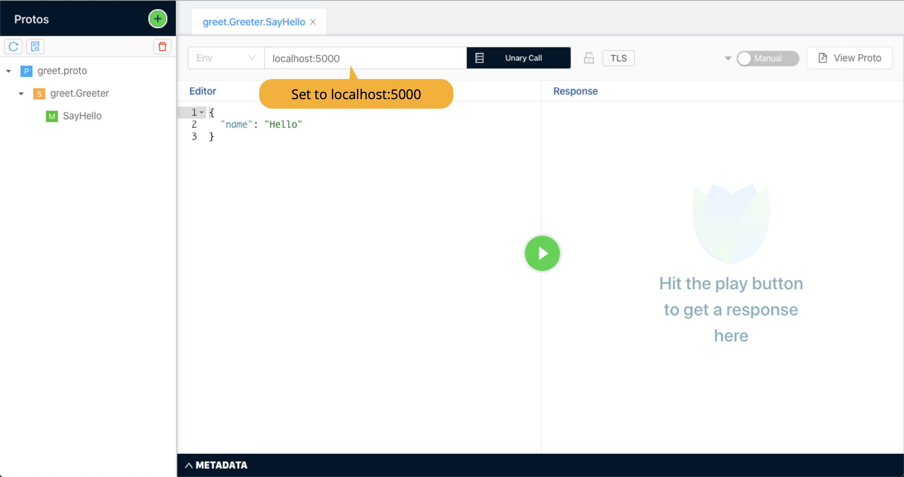
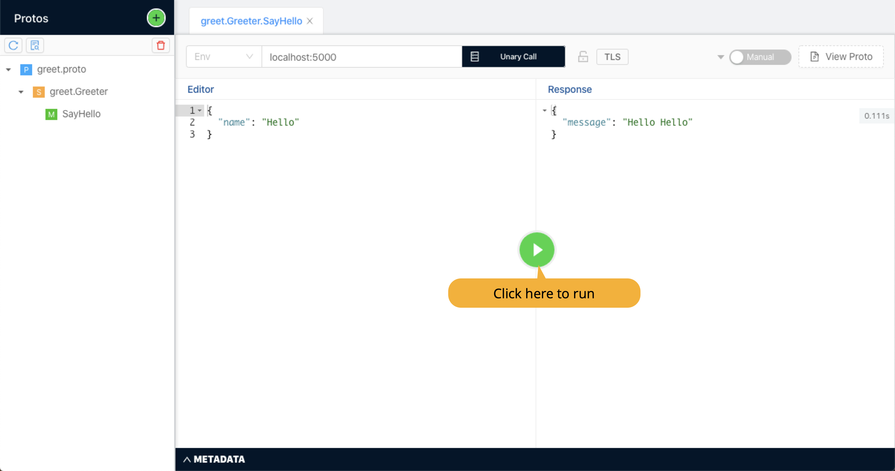
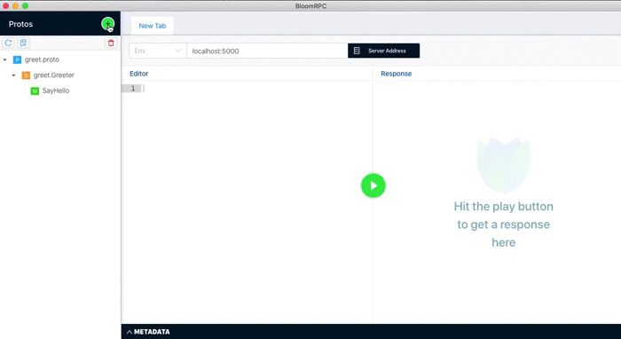

# gRPC Streaming with Dotnet and Docker

In this workshop we will create a grpc streaming server, test it with a gRPC GUI client and then write a console app that can connect to a gRPC streaming service.

This will be helpful for anyone who is just getting started with gRPC in a new project.

This is a purely handson workshop and does not talk about gRPC or protobuf in depth.


- **[Pre-requisites](#pre-requisites)**

  > *Shell, Dot Net Core 3.1, BloomRPC, Docker*

- **[Create a gRPC service](#create-service)**

  > *Create service using `dotnet new grpc`*

- **[Test gRPC service](#test-service)**

  > *Test a gRPC endpoint using BloomRPC*

- **[Create gRPC service](#create-client)**

  > *Create a console app using `dotnet new console` and get response from a gRPC endpoint*

- **[Create gRPC streaming endpoint](#create-stream)**

  > *Add streaming endpoint to our grpc server*


<a name="pre-requisites"></a>

### Pre-requisites

- **Shell** 

  All commands are written for bash on MacOS, but you can use them in a **GitBash** or **Powershell**. We have used CLI instead of Visual Studio as it gives better view of what is going on underneath.

- **DotNet Core 3.1**

  We have used 3.1 as DotNet 5 is still in beta. Though everything should work the same with 5. If it does not, please help us all by reporting it.

- **BloomRPC**

  Download from here : https://appimage.github.io/BloomRPC/. We use it to tests our gRPC server, before we start writting a client ourselves.

- **Docker**


<a name="create-service"></a>

# Step1 - Creating a gRPC service

```bash
# Create a folder for our project
mkdir dotnet-docker-grpc-stream

# Create a new project names as Service
dotnet new grpc -o Service

# Generate a gitignore file
dotnet new gitignore

# Start our server
cd Service
dotnet run

# Commit your code
git add --all
git commit -m "Created a web service"
```

>  If you are using MacOS, you will get error. Kestrel doesn't support HTTP/2 with TLS on macOS and older Windows versions such as Windows 7.
>
> You will be able to run the server after next step in which we will run service inside docker container.
>
> If you still want to fix this, read  https://docs.microsoft.com/en-us/aspnet/core/grpc/troubleshoot?view=aspnetcore-3.1#unable-to-start-aspnet-core-grpc-app-on-macos


**Create a file `Service/Dockerfile`**

```dockerfile
# Service/Dockerfile

FROM mcr.microsoft.com/dotnet/core/sdk:3.1 AS build
WORKDIR /source

COPY ./*.csproj .
RUN dotnet restore

COPY . .
RUN dotnet publish -c release -o /app --no-restore

FROM mcr.microsoft.com/dotnet/core/aspnet:3.1
WORKDIR /app

COPY --from=build /app .

EXPOSE 80  
ENTRYPOINT ["dotnet", "Service.dll"]
```

Create another file `Service/.dockerignore` to tell docker which files to ignore

```bash
# Service/.dockerignore

**/.dockerignore
**/.project
**/.vs
**/.idea
**/.vscode
**/*.*proj.user
**/bin
**/Dockerfile*
**/obj
```

Now run the server as docker container: 

```bash
# Build docker image
docker build -t server .

# Run service as container
docker run -p 5000:80 server
```

Checkout a protobuf created at `dotnet-docker-grpc-stream/Service/Protos/greep.proto`. We will use it in next step to test our server.


<a name="test-service"></a>

# Step 2 - Testing a gRPC endpoint 

Just like we can use postman to test an HTTP endpoint, we will use [BloomRPC](https://appimage.github.io/BloomRPC/.) to test our gRPC endpoint.

Download and open the app from [here](https://appimage.github.io/BloomRPC). 




Now select the file from our project :  ``dotnet-docker-grpc-stream/Service/Protos/greep.proto`` 




Now enter the address for our gRPC server in address bar as `localhost:5000`




If the server is not running, start it as a container : 

```
docker run -p 5000:80 server
```

Now click on the play button to test our endpoint.




<a name="create-client"></a>


# Step - 3 Create a client app

In this step we will create a .netcore console app and hit our server to read from gRPC endpoint.

Create a console app in the root directory of our project

```bash
# Go to our project's root (assuming you are in Service directory)
cd ../
dotnet new console -o Client
```


We need following libraries to make our client work : 

- [Grpc.Net.Client](https://www.nuget.org/packages/Grpc.Net.Client), which contains the .NET Core client.
- [Google.Protobuf](https://www.nuget.org/packages/Google.Protobuf/), which contains protobuf message APIs for C#.
- [Grpc.Tools](https://www.nuget.org/packages/Grpc.Tools/), which contains C# tooling support for protobuf files. The tooling package isn't required at runtime, so the dependency is marked with `PrivateAssets="All"`.

```bash
dotnet add package Grpc.Net.Client
dotnet add package Google.Protobuf
dotnet add package Grpc.Tools
```


Add the proto files from our server to client project at `Client/Protos/greet.proto`

```bash
mkdir Protos
cp ../Service/Protos/greet.proto ./Protos/
```


Modify the `Client/Client.csproj` file to add reference to the proto file

```xml
<ItemGroup>
  <Protobuf Include="Protos\greet.proto" GrpcServices="Client" />
</ItemGroup>
```


Now create the Program.cs as 

```csharp
using System;
using System.Threading.Tasks;
using Grpc.Net.Client;
using Service;

namespace Client
{
  class Program
  {
    static void Main()
    {
      // Ignore this for now
      AppContext.SetSwitch(
        "System.Net.Http.SocketsHttpHandler.Http2UnencryptedSupport", true);
      
      SayHello();
    }

    private static void SayHello()
    {
      using var channel = GrpcChannel.ForAddress("http://localhost:5000");
      
      // Greeter service is defined in hello.proto
      // <service-name>.<service-name>Client is auto-created
      var client = new Greeter.GreeterClient(channel);
      
      // HelloRequest is defined in hello.proto
      var request = new HelloRequest();
      request.Name = "Nishant";
      
      // SayHello method is defined in hello.proto
      var response = client.SayHello(request);
      
      // HelloResponse.Message is defined in hello.proto
      Console.WriteLine(response.Message);
    }
  }
}
```

> If you did the fix for MacOS while creating the server, make sure you add a line `AppContext.SetSwitch("System.Net.Http.SocketsHttpHandler.Http2UnencryptedSupport", true);` to start of main method in Client/Program.cs


```
# Run the server is not running
docker run -p 5000:80 server
```


<a name="create-stream"></a>

# Step 4 - Create a streaming endpoint

Now we will create a protobuf file for an streaming interface and take a look at the protobug syntax.

We will create a server that can take a financial instrument and stream its price in real time.


### Define protobuf

It is very much like defining a class in C#. Though there is one big difference that there is a number associated with each field in message. **This number is used to identify field in binary message data.** Unlike REST, the messages in gRPC are sent and received in binary. Which makes is much more efficient.

Create our `prices.proto` file in `Server/Protos/prices.proto`: 

```protobuf
// Server/Protos/prices.proto

syntax = "proto3";
package prices;

// Code will be generated in this namespace
option csharp_namespace = "Service";

// The gRPC interface definition
service Pricing {
  // Note that it returns "stream" of PriceResponse
  rpc Subscribe (PriceRequest) returns (stream PriceResponse);
}

// The request message
message PriceRequest {
  string uic = 1;
  string assetType = 2;
}

// The response message
message PriceResponse {
  string quote = 1;
}
```

Take a note of returns statement here. **The return type is a stream of PriceResponse instead of a single instance of PriceResponse.**

Here we define the interface for our service. It is very much like an interface in C#. This interface is known by both client and server. The nugets on client and server generate code based on this protobuf file.


Now we will include the file in our `Service/Service.csproj`.

```xml
<!-- Service/Service.csproj --> 

<ItemGroup>
  <Protobuf Include="Protos\greet.proto" GrpcServices="Server" />
  <Protobuf Include="Protos\prices.proto" GrpcServices="Server"/>
</ItemGroup>
```

Notice that it already has a `greet.proto`  defined that was created by default and that we used in first part of the workshop.


**Create implementation of the endpoint**

Create file `Services/PricingService.cs `:

```csharp
using System;
using System.Threading.Tasks;
using Grpc.Core;

namespace Service
{
  // Pricing is the name or interface in prices.proto
  // <service-name>.<service-name>Base class is auto generated
  public class PricingService : Pricing.PricingBase
  {

    public override async Task Subscribe(
      PriceRequest request, 
      IServerStreamWriter<PriceResponse> responseStream, 
      ServerCallContext context
    ){
      var i = 0;
      while (true)
      {
        // At every second, keep sending a fake response
        await Task.Delay(TimeSpan.FromSeconds(1));
        var quote = $"Quote#{++i} for {request.Uic}-{request.AssetType}";
        Console.WriteLine($"Sent: {quote}");
        var response = new PriceResponse{Quote = quote};
        await responseStream.WriteAsync(response);
      }
    }
  }
}
```


Now register our  **PricingService** in `Startup.cs`

```diff
 app.UseEndpoints(endpoints =>{
   endpoints.MapGrpcService<GreeterService>();
+  endpoints.MapGrpcService<PricingService>();
}
```

Notice that the GreeterService was created by default with the project.


Now lets build and run our service as docker image: 

```bash
docker build -t server .
docker run -p 5000:80 server
```


Now in BloomRPC, click on **+** icon and add our `Service/Protos/prices.proto`



